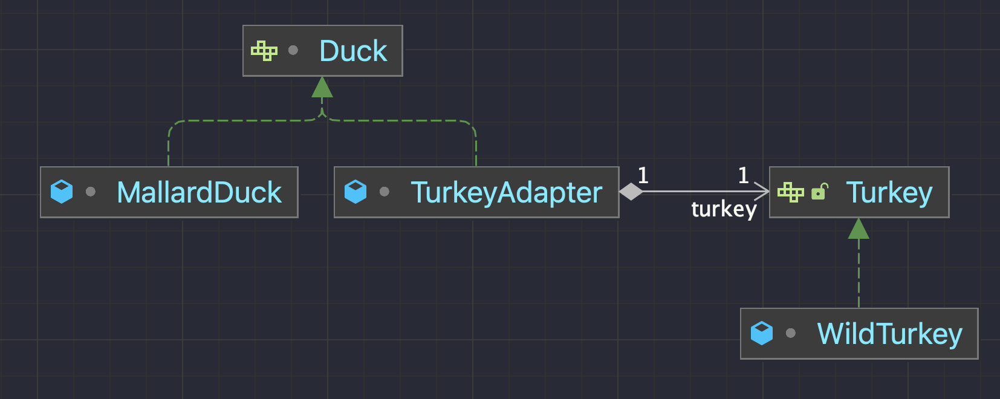

GoF 책에서는 다음과 같이 어댑터 패턴의 의도를 밝힌다.

> 클래스의 인터페이스를 사용자가 기대하는 인터페이스 형태로 변환 시킵니다.  
> 서로 일치하지 않는 인터페이스를 갖는 클래스들을 함께 동작시킵니다.

어탭터 패턴은 실제 어댑터의 기능과 같다.

_adapter: 다른 전기나 기계 장치를 서로 연결해서 작동할 수 있도록 만들어 주는 결합 도구_

즉, 중간 다리(어댑터)를 연결해서 다른 인터페이스를 호환할 수 있도록 하는 디자인이다.

# 예시 코드

아래의 코드에서 특정 시스템에 Duck이 아닌 Turkey를 사용하고자 하는데, Duck이 이미 많은 사용자가 사용하고 있는 상황이라면?

```java
public class Client {
    public static void main(String[] args) {
        Duck duck = new MallardDuck();
        duck.fly();
    }
}

public interface Duck {
    public void quack(); 
    public void fly();
}

public class MallardDuck implements Duck {
    @Override
    public void quack() {
        System.out.println("꽥꽥");
    }

    @Override
    public void fly() {
        System.out.println("오리 날다.");

    }
}
```

Adapter Pattern을 활용해 다음과 같이 해결할 수 있다.

```java
public class Client {
    public static void main(String[] args) {
        Turkey turkey = new WildTurkey();
        Duck duck = new TurkeyAdapter(turkey);
        duck.fly();
    }
}
```

```java
class TurkeyAdapter implements Duck{
    private final Turkey turkey;

    public TurkeyAdapter(Turkey turkey) {
        this.turkey = turkey;
    }

    @Override
    public void quack() {
        turkey.gobble();
    }

    @Override
    public void fly() {
        IntStream.range(0, 5).forEach(notUsed -> turkey.fly());
    }
}
```

```java
public interface Turkey {
    void gobble();
    void fly();
}
```

```java
class WildTurkey implements Turkey{

    @Override
    public void gobble() {
        System.out.println("골골");
    }

    @Override
    public void fly() {
        System.out.println("퍼더덕");
    }

}
```



기존의 Duck은 유지한 채 TurkeyAdapter로 새로운 인터페이스를 쉽게 호환시킬 수 있다. 이로 인해 _기존의 Client 측에서는 코드의 변경이 필요없게 된다._

패턴을 활용한 리팩터링에서는 다음 조건을 모두 만족한다면 Adapter 패턴으로 리팩터링하는 것을 권장하고 있다.

1.  두 클래스가 동일하거나 유사한 작업을 수행하지만 인터페이스가 서로 다른 경우
2.  두 클래스가 공통 인터페이스를 가지면, 클라이언트 코드가 더 간단하고 명료해질 수 있는 경우
3.  외부 라이브러리라서 인터페이스를 바꾸고 싶어도 쉽게 바꿀 수 없는 경우, 또는 인터페이스가 프레임워크의 일부라서 이미 많은 클라이언트에서 사용되고 있는 경우, 또는 소스 코드를 갖고 있지 않는 경우

---

## Reference

-   Head First Design Patterns
