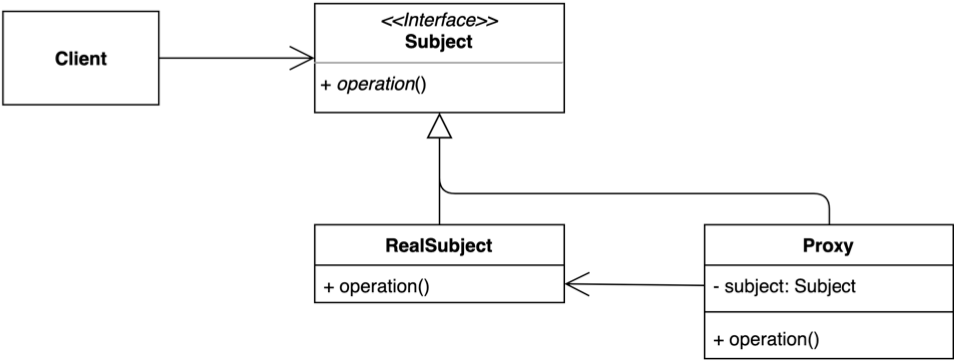

GoF 책에서는 다음과 같이 프록시 패턴의 의도를 밝힌다.

> 다른 객체에 대한 접근을 제어하기 위한 대리자 또는 자리채움자 역할을 하는 객체를 둡니다.



Subject 구현체(Proxy)로 Request() 함수를 호출할 때 RealSubject를 참조하고 있는 Proxy가 RealSubject를 대리하는 구조이다.

프록시를 사용하면 메서드 실행 이전 이후에 대한 처리, cache, lazy loading 등 다양한 역할을 할 수 있다.

예시와 함께 프록시 패턴에 대해서 간단하게 파악해보자.

다음은 주문을 하기 위해 상품을 담고, 어떠한 처리를 수행하는 `Order`가 있다.

```java
Order order = new Order();
order.add("apple");
order.process();
```

```java
public class Order {

    private final List<String> products = new ArrayList<>();

    public Order() {}

    public void add(String product) {
        products.add(product);
    }

    public void process() {}
}
```

우리는 프록시를 이용해 상품을 추가하는 `add()` 실행 이전과 이후에 대한 로그를 남기려고 한다.

단순히 `add()` 내에 로그를 추가할 수 있지만, 프록시 패턴을 학습하는 이유가 없을 것이다.

만약 해당 시스템이 세분화되어 Order가 OfflineOrder, OnlineOrder로 나뉘게 되었을 때, 각 클래스의 `add()` 에 로그를 추가하는 것이 좋은 방향이라고 볼 수 있는지 생각해보아야 한다.

여러 클래스에 같은 로그를 중복하여 생성되는 보일러 플레이트는 우리 눈을 질끔 감게 만든다.

이제 프록시 패턴을 활용하여 코드를 변경해보도록 하자.

```java
public interface Orderable {
    void add(String product);
    void process();
}
```

```java
public class Order implements Orderable {
    private final List<String> products = new ArrayList<>();

    @Override
    public void add(String product) {
        products.add(product);
    }

    @Override
    public void process() {}
}
```

```java
public class OrderProxy implements Orderable {
    private final Orderable order;  

	// Orderable을 구현하는 객체를 주입받을 수 있다.
    public OrderProxy(Orderable order) { 
        this.order = order;
    }

    @Override
    public void add(String product) {
        System.out.printf("Log: [%s]를 담기 전.%n", product);
        order.add(product);
        System.out.printf("Log: [%s]를 담기 후.%n", product);
    }

    @Override
    public void process() {}
}
```

```java
Orderable order = new OrderProxy(new Order());
order.add("apple");

/* 
Output:
Log: apple을 담기 전
Log: apple을 담기 후
*/
```

위와 같이 실제 클래스에 불필요한 요소들은 프록시 객체에게 위임함으로써 실제 기능 동작을 위한 로직만 남겨 코드를 작성할 수 있다.

---

## Reference

- [https://johngrib.github.io/wiki/pattern/proxy/](https://johngrib.github.io/wiki/pattern/proxy/)
- [https://ko.wikipedia.org/wiki/%ED%94%84%EB%A1%9D%EC%8B%9C\_%ED%8C%A8%ED%84%B4](https://ko.wikipedia.org/wiki/%ED%94%84%EB%A1%9D%EC%8B%9C_%ED%8C%A8%ED%84%B4)
